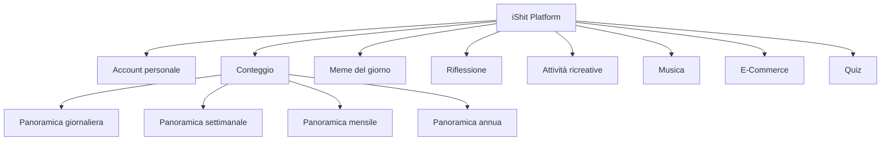

<!-- @format -->

# iShit

iShit è una piattaforma dove potrai intrattenerti durante l'esecuzione di uno dei bisogni primari dell'umanità.

In iShit potrai conteggiare quante volte andrai al bagno e avere una statistica accurata di tutte le tue sessioni impegnative, e non solo.

## Account personale

In iShit potrai creare un profilo personalizzabile ed avere interazioni con altri utenti della piattaforma!

## Achievment

Nella piattaforma avrai la possibiltà di ricevere premi e titoli che ti distingueranno dalla massa.

## Conteggio

Potrai cliccare il bottone per registrare in app quando stai effettuando la tua sessione, e potrai avere una scheda con una panoramica giornaliera, settimanale, mensile o addirittura annua!

## Meme del giorno

Avrai la possibilità di navigare e scegliere un meme che descriva esattamente la sessione che stai affrontando in quel preciso istante!

## Riflessione

Ti daremo la possibilità di condividere pensieri o riflessioni profonde scaturite dalla tua sessione ed avere dei riscontri dagli altri utenti!

## Fatto del giorno

Ogni giorno avrai un fatto divertente inerente a questo mondo!

## Attività ricreative

Una volta premuto sul bottone iniziale, avrai accesso ad una serie di attività per passare il tempo tra uno sforzo e l'altro!

## Musica

In iShit abbiamo integrato un music player con una playlist adatta al contesto, così da facilitare la sessione in corso!

## E-Commerce

Avrai anche la possibilità di navigare nello store affiliato, dove troverai prodotti inerenti a tutto quello che può servirti durante queste grandi imprese.

## Quiz

Potrai distrarre la tua mente dai grandi sforzi leggendo e rispondendo a delle domande di cultura generale, ma anche stimolanti!

## 📜 Disclaimer Legale

iShit è un progetto originale ideato e sviluppato da Andrea Marchese e Davide D'Amico, concepito con finalità umoristiche e ricreative. Ogni contenuto, funzionalità e descrizione presenti in questa repository sono da considerarsi protetti dalla normativa sul diritto d'autore, ove applicabile.

⚠️ Qualsiasi tentativo di copia, distribuzione non autorizzata, o utilizzo commerciale dell'idea o del codice sorgente, senza consenso scritto dell'autore, sarà considerato una violazione dei diritti intellettuali.

La repository ha data certa tramite GitHub e rappresenta una prova documentata della paternità del progetto.

---

## 📌 Nota Etica

Il progetto è sviluppato per scopi di intrattenimento e non intende offendere, denigrare o risultare inappropriato. Ogni contenuto presente è da intendersi in chiave satirica e ironica.

Per contatti o collaborazioni, si prega di aprire un'issue o inviare una mail a yocopk@gmail.com.

